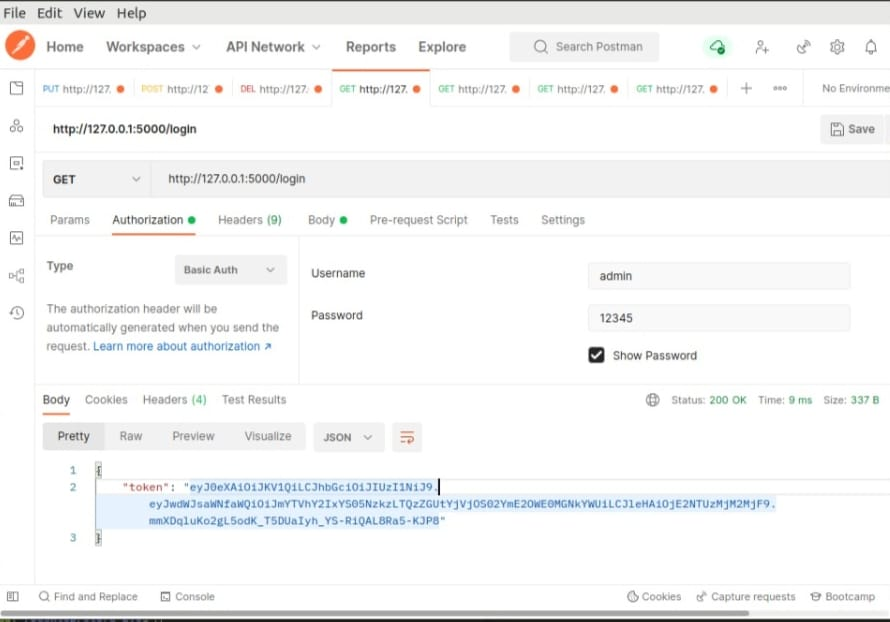
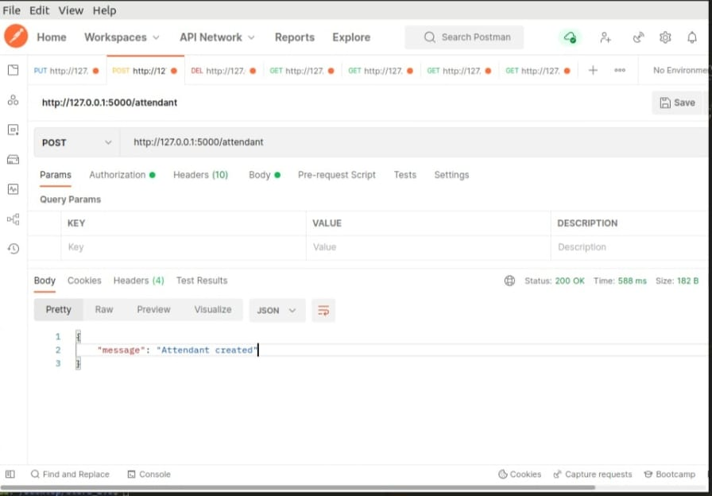
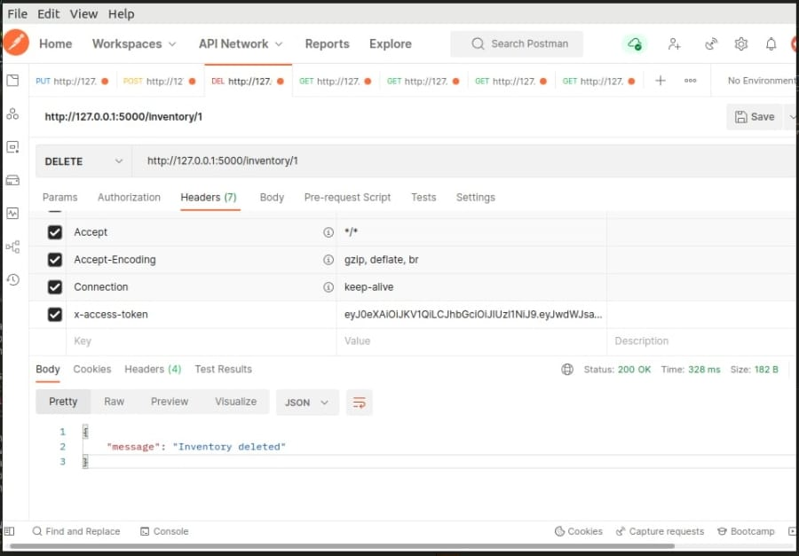

# Store_manager_backend
This is a backend for the store manager (https://jck-bit.github.io/Level_up/). The backend is written in *Python and uses the Flask framework and SQLAlchemy* to connect to a database. It also uses the JWT library to authenticate users...it has  admin  and a user pages.

# Admin
```
1.can add new users
2.can add new products
3.Delete products
4.Delete users

```
# Attendant
```
1.can view products
2.can view users

```
# Test

Its tested by postman and it works perfectly.*As For now no Tests have been written.*

# Tokens
After Log in, a token is provided to the user. which expires after a certain time.



# Attendants
 An admin can create *new attendants and also delete attendants.*





# Authors
The backend is written by Jack *-[Jck Bit]()*
